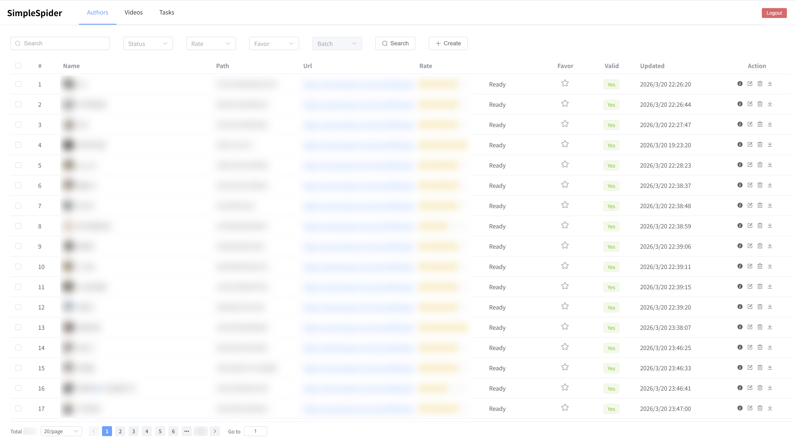
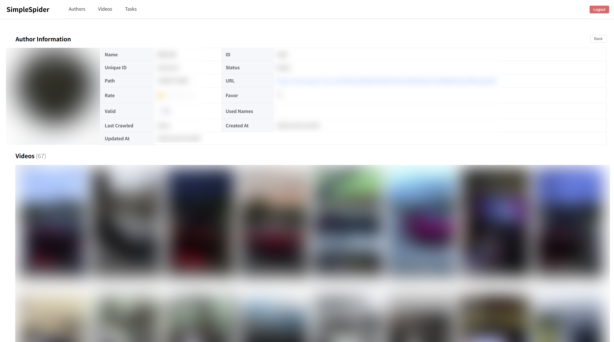
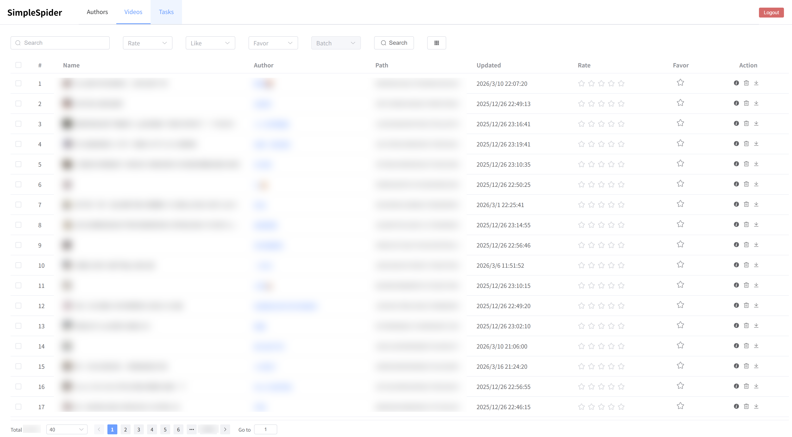
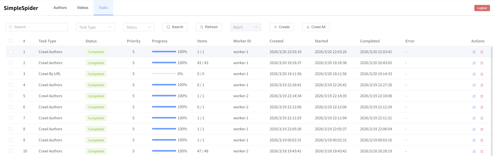
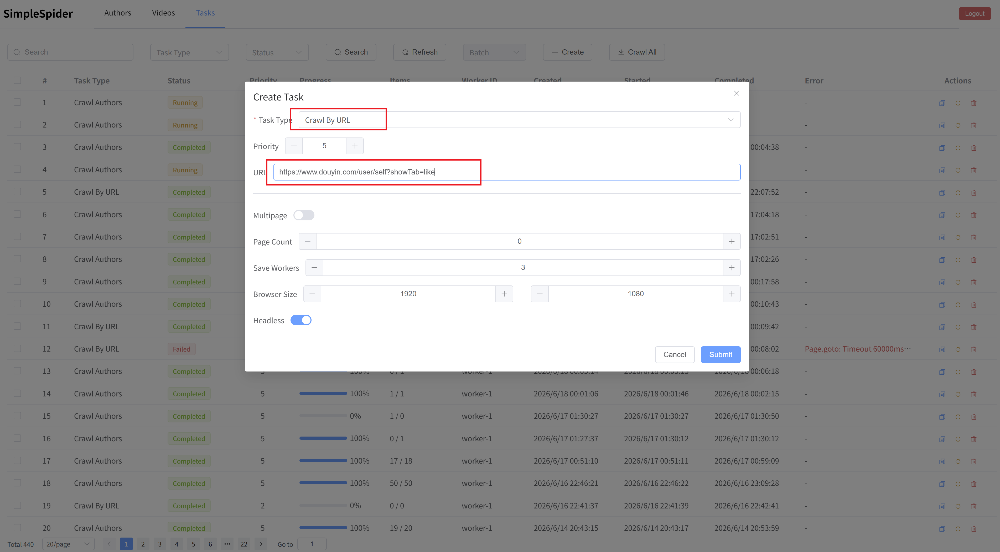
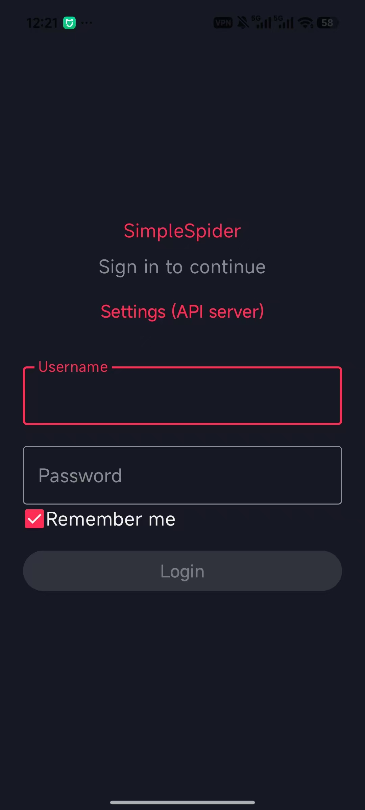
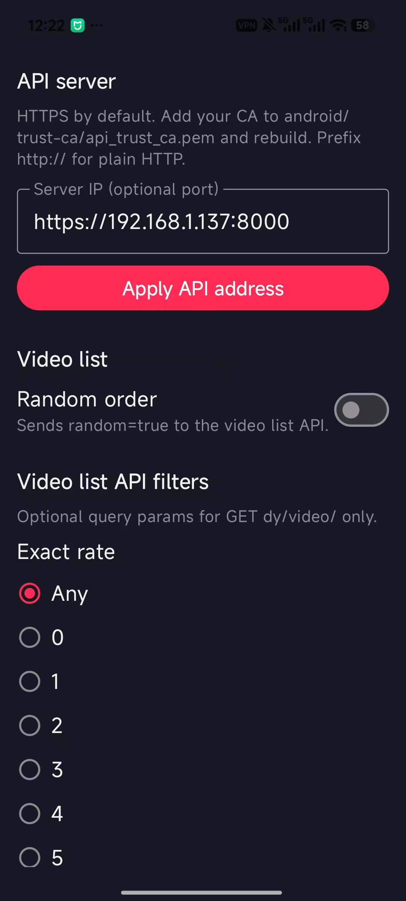

# SimpleSpider（抖音内容爬取与管理）

这是一个使用 Django REST Framework 和 Vue 3 开发的抖音内容管理与抓取项目，并附带可选的 **Android 客户端**。系统包含：

- 爬虫基于 Playwright，可批量爬取喜欢/收藏视频，可批量爬取多位作者的所有视频
- 便捷的 Web UI：下发爬取任务，可配置请求数量、线程数、筛选条件、多页爬取等
- 内容管理：管理爬取到的作者和视频（Web 前端基于 Vue 3 和 Element Plus；Android 端可浏览作者与视频、竖滑播放、评分与筛选）
- 使用 Python threading 作为爬取和下载 Worker，不依赖 Celery
- 使用数据库作为 broker，无需部署 Redis
- 自动评分：可导出人工评分数据并训练模型，再通过模型自动评分

## 目录说明

- `backend/`：Django 后端（API、数据库、任务队列、管理命令）
- `frontend/`：前端（Vue 3）
- `android/`：Android 客户端源码
- `templates/`：部署模板（systemd service、Nginx 配置等）

## 快速开始

以下步骤覆盖爬虫、API 与数据处理的基本部署。

### 后端

前提说明：

- 需要在 Linux 桌面图形环境运行（`set_cookies` 会打开有界面浏览器）
- 后端默认使用 PostgreSQL
- 任务队列通过 `python manage.py start_crawler` 启动（下载可另启 `start_downloader`）
- 默认服务端口：`8000`

1. 安装依赖

```bash
cd backend
pip install -r requirements.txt
playwright install
```

2. 配置 IP/端口（前后端互通）

- 修改 `backend/backend/settings.py`
  - 如需要跨域访问，请调整 `CORS_ALLOWED_ORIGINS`
  - 默认使用 PostgreSQL：修改 `DATABASES['default']` 中的 `HOST`、`PORT`、`NAME`、`USER`、`PASSWORD`
  - 若改用 SQLite：将 `DATABASES['default']` 改为与文件中 `DATABASES['sqlite']` 相同的 sqlite3 配置
- 修改 `frontend/src/config/index.js`
  - 根据你实际访问前端的主机名，调整 `HOST_TO_APIDOMAIN`
  - 同时更新 `DEFAULT_APIDOMAIN`，确保 `APIURL/STATICURL/DYURL` 指向你的后端 `host:port`

3. 初始化数据库

```bash
python manage.py makemigrations
python manage.py migrate
python manage.py createsuperuser
```

4. 设置 Cookie（首次/更新时）

```bash
python manage.py set_cookies
```

命令会打开一个有界面浏览器窗口，你需要手动登录并完成授权，等待命令保存 cookie。

5. 启动后台 Worker

```bash
python manage.py start_crawler --max-concurrent-tasks 2
```

可选：在另一终端（或另一台机器，需共用同一数据库）启动下载 Worker：

```bash
python manage.py start_downloader
```

`start_crawler` 会从数据库拉取任务并执行抓取等逻辑；`start_downloader` 负责下载 `valid=False` 的媒体文件。

6. 启动 API 服务

开发调试：

```bash
python manage.py runserver 0.0.0.0:8000
```

生产部署一般建议使用 gunicorn（可参考 `templates/simplespider.service`）。

访问：

- Django 管理后台：`http://localhost:8000/admin/`
- API：`http://localhost:8000/api/`

### 前端

内容管理、展示、任务下发、数据标记。

#### 界面预览

以下为部分页面截图（资源位于 `docs/images/`）。

**作者列表**



**作者详情**



**视频列表**



**任务列表**



1. 构建静态资源

```bash
cd frontend
npm install
npm run build
```

2. 让前端静态文件被后端/Nginx 提供

- 若使用 Nginx，配合 `templates/simplespider.conf`
- 若使用 gunicorn/Django 方式，也需要确保静态目录与路由配置正确

## 开始任务

1. 若「快速开始」中已执行过 `set_cookies`，可跳过。否则在后端桌面环境中进入 `SimpleSpider/backend`，执行：

```bash
python manage.py set_cookies
```

该步骤会打开浏览器，请通过扫码或验证码登录抖音账号；登录成功后，SimpleSpider 会自动获取 cookies 并关闭浏览器。

2. 启动爬取 Worker 与下载 Worker（可与「快速开始」第 5 步相同）。下载器可部署在其他机器上，通过数据库与 crawler 协同，下载 crawler 写入的 URL 对应的视频或图片：

```bash
python manage.py start_crawler &> crawler.log &
python manage.py start_downloader &> downloader.log &
```

> 注意：`downloader` 与 `crawler` 必须使用相同的数据库配置。

3. 在前端打开 Tasks 页面，点击新建，选择 **Crawl by URL**，填写收藏或喜欢页的 URL，提交后任务会自动运行。



常用 URL：

- 我的喜欢：<https://www.douyin.com/user/self?showTab=like>
- 我的收藏：<https://www.douyin.com/user/self?showTab=favorite_collection>

## Android 客户端（可选）

### 获取安装包

预编译 APK（文件名与版本以下载为准）：[simplespider-0.0.1.apk](http://lufy.org:8000/simplespider-0.0.1.apk)。

该 APK 已内置固定 CA。若你的后端使用 **另一套** HTTPS 自签名证书，请将 CA 证书放到 `android/trust-ca/api_trust_ca.pem`，并用 **Android Studio 打开 `android` 目录** 重新编译 APK。详见 [Android README](android/README.md)。

### 使用前请确认

- 本项目的 **Django 后端** 已启动，且手机或模拟器 **能访问** 该地址（例如同一局域网内的 `http://电脑IP:8000` 或 `https://电脑IP:端口`）。
- 已在后台 **创建好登录用户**；在 App 中用该账号密码登录。
- 安装打开后，请先到 **Settings**，将 **API server** 改为实际 **主机或 `主机:端口`**（默认 HTTPS；需要 HTTP 时在地址前加 `http://`），再点 **Apply API address**。





### 自行从源码编译（可选）

用 **Android Studio** 打开仓库里的 **`android`** 目录（不要只打开 `android/app`），待 Gradle 同步完成后 **Run** 到设备，或通过菜单生成 APK。更多说明见 [Android README](android/README.md)。

## 部署模板（可选）

- `templates/simplespider.service`：gunicorn（API）systemd 模板
- `templates/start_workers.service`：Worker 进程（数据库任务队列）systemd 模板

将模板中的占位符替换为实际路径（项目根目录、虚拟环境等），再用 `systemctl` 启动。

## 自动评分（Auto rate）

模型训练代码见 [SimpleModels](https://github.com/lufy90/SimpleModels)。流程：在前端给视频打人工分 → 导出数据集 → 训练 → 部署 ONNX → 批量自动评分。

### 1. 准备标注数据

在 Web 前端 **Videos** 页面为视频打 **1–5 分**（须为人工评分，非自动评分）。积累一定数量后再导出。

### 2. 导出训练数据

在 `backend` 目录执行（导出 `is_auto_rated=False` 且 `rate` 为 1–5 的视频）：

```bash
cd backend

# 导出封面（训练常用，推荐）
python manage.py export_covers -o dataset

# 或：从视频均匀截帧（需已下载 video.mp4）
python manage.py export_captures --num-captures 5 -o dataset_captures
```

输出目录结构为 `dataset/1/` … `dataset/5/`，可直接用于训练。

### 3. 训练模型

将 `dataset`（或 `dataset_captures`）交给 [SimpleModels](https://github.com/lufy90/SimpleModels) 按该仓库说明训练，得到 ONNX 模型文件。

### 4. 部署模型

将训练得到的 ONNX 复制为后端默认路径：

```bash
cp /path/to/your/best.onnx backend/best.onnx
```

`backend/backend/settings.py` 中 `AUTO_RATE_MODEL_PATH = 'best.onnx'`（相对 `backend/` 运行目录）。改路径或文件名时需同步修改该项。

### 5. 运行自动评分

```bash
cd backend

# 快速模式：仅用 cover.jpg（默认只处理 rate=0 的视频）
python manage.py auto_rate

# 精确模式：从 video.mp4 抽帧后综合打分
python manage.py auto_rate -p
```

成功后视频的 `rate` 会更新，并标记 `is_auto_rated=True`。
## 已知问题

项目使用 Python multithreading 进行并发爬取。受限于 Python GIL 及 Playwright 的多线程限制，实际无法同时打开多个 Headless 浏览器并发爬取；虽然可配置多个 Crawler worker，但同时只会有 1 个 Crawler Worker 使用浏览器。后续可能改用 Python multiprocessing 作为 Crawler worker。

### 为什么不使用 Celery 和 Redis

Celery 和 Redis 可以为系统提供更健壮的任务管理能力。当前主要考虑减少外部依赖，使用基于 Python 线程的自定义 Worker 进行调度与管理。

## 许可证

本项目使用 **GNU Affero General Public License v3.0 only**（AGPL-3.0-only）。

许可证全文：<https://www.gnu.org/licenses/agpl-3.0.html>

## 使用与合规免责声明

本项目仅用于学习与研究目的。任何人使用本项目及其产生的结果，应当遵守中华人民共和国相关法律法规。
若存在任何违反中国法律法规的使用情形及其后果，由使用者自行承担全部责任；与项目作者无关。
